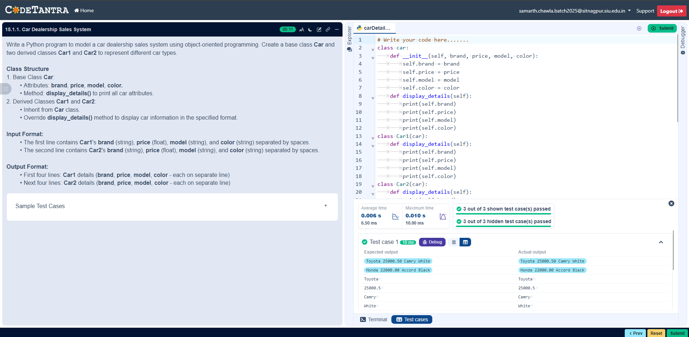

## Problem Statement
Write a Python program to model a car dealership sales system using object-oriented programming. Create a base class Car and two derived classes Car1 and Car2 to represent different car types.

---

## Algorithm

Start

Read input for Car1 → brand, price, model, color

Read input for Car2 → brand, price, model, color

Create object car1 using class Car1

Create object car2 using class Car2

Call display_details() for car1

Call display_details() for car2

Stop
---

## Flowchart

---

## Execution

  

